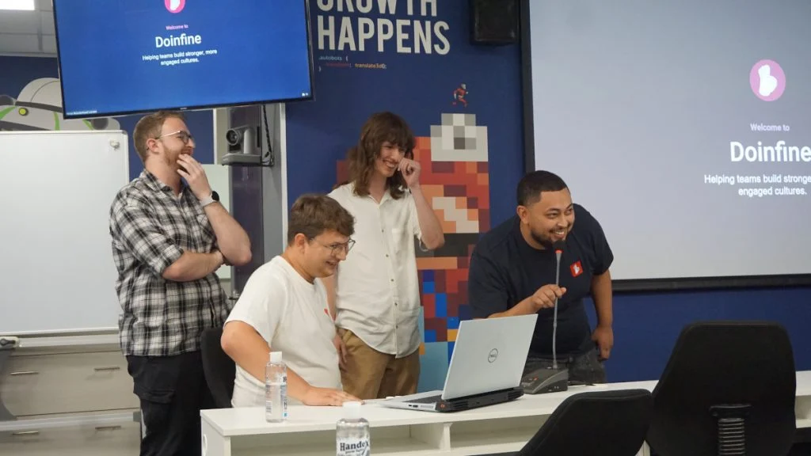

# 👌Doinfine

## Overview

Doinfine is a passion project that was built by a team to help teams create a team charter and celebrate wins within the team. 
Doinfine also includes a "fine" feature. 

## Doinfine's Lifetime

### 2022 - Launch

> [✨Doinfine POC](https://github.com/hercobezuidenhout/doinfine-poc)

Doinfine launched for the first time in 2022 and onboarded its first team. A couple months later, it had 3 teams using it. This version of Doinfine was later dubbed as the POC (Proof of Concept).

#### Team

- Herco Bezuidenhout | Software Engineer

### 2023 - Entelect Tech Accelerator

> [🏆Doinfine Tech Accelerator 2023](https://github.com/hercobezuidenhout/doinfine-techacc2023)

Doinfine enrolled and won [Entelect's Tech Accelerator](https://businesstech.co.za/news/industry-news/734487/entelect-tech-accelerator-enters-10th-year-with-its-largest-number-of-entrants-yet/) in 2023 thanks to the hard work of the team. While not all of the team members embarked on the next journey of monitizing Doinfine, winning Tech Accelerator would not have been possible without their help

#### Team

- Ben Kotze | Software Engineer
- Keane Burgers | Software Engineer
- Emile Fourie | UX Engineer
- Jarred Fourie | UX Engineer
- Herco Bezuidenhout | Software Engineer

### 2024 - Becoming Market Fit

After winning Tech Accelerator, the next mission was to become market fit. While not all of the Tech Accelerator team members could join on this journey, some did. Doinfine has gone through some
iterations of improving, perfecting and ultimately trying to figure out what people want and will pay for.

#### Team

- Ben Kotze | Software Engineer
- Jarred Fourie | UX Engineer
- Herco Bezuidenhout | Software Engineer

### 2025 and onward - Sunset

A lot of effort has been put in to trying to get Doinfine market fit, however, it is not successful. There are many learnings that the team can take and apply, but the team has become occuppied with other projects and priorities. 

While Doinfine still has a couple of teams using it, the main reason for sunsetting it is to shift focus to other projects. Doinfine will still be available for the existing teams and will allow new sign ups, however, there will not be any more development on it. 

A small support system is available for bug reports.
